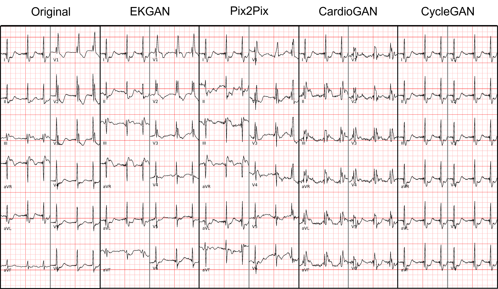
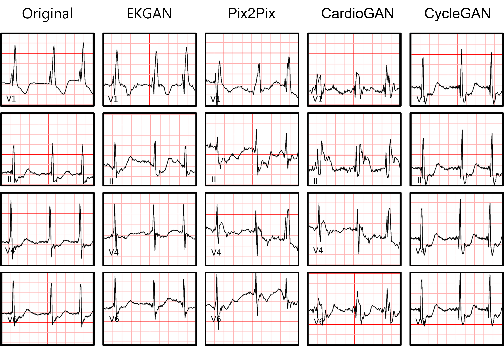
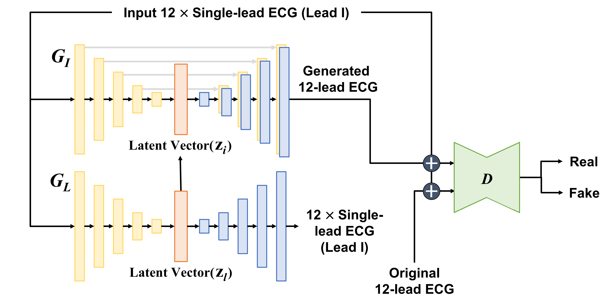

# Twelve-Lead ECG Reconstruction from Single-Lead Signals Using Generative Adversarial Networks


### Repository for [Twelve-Lead ECG Reconstruction from Single-Lead Signals Using Generative Adversarial Networks](https://link.springer.com/chapter/10.1007/978-3-031-43990-2_18) published in [MICCAI 2023](https://conferences.miccai.org/2023/en/)
 #### Jinho Joo<sup>1</sup>\*, Gihun Joo<sup>1</sup>\*, Yeji Kim<sup>2</sup>, Moo-Nyun Jin<sup>2</sup>, Junbeom Park<sup>2</sup>\*\*, Hyeonseung Im<sup>1</sup>\*\*  
 #### <sup>1</sup>Kangwon National University, <sup>2</sup>Ewha Womans University Medical Center  
 #### \* denotes equal contribution, \** denotes corresponding authors  

<p align="center"></p>
<p align="center"></p>

## Our Goal
We propose a novel generative adversarial network that can faithfully reconstruct 12-lead ECG signals from single-lead signals.
Our method can reconstruct 12-lead ECGs with CVD-related characteristics effectively.
Thus, our method can be used to bridge commonly available wearable devices that can measure only Lead I and high-performance deep learning-based prediction models using 12-lead ECGs.

## EKGAN Architecture
<p align="center"></p>

## Experiments
We implemented not only EKGAN but also [Pix2pix](https://arxiv.org/pdf/1611.07004.pdf), [CycleGAN](https://arxiv.org/pdf/1703.10593.pdf), and [CardioGAN](https://arxiv.org/pdf/2010.00104.pdf) with minor modifications so that they can be applied to ECG data. Additionally, 12-lead ECGs were generated by using both the validation and test sets, and their quality was evaluated by using a CVD [prediction model](https://www.nature.com/articles/s41467-020-15432-4), comparing the classification performance with the original 12-lead ECGs and the generated ones, and examined by three cardiologists.

## Citation
```
@inproceedings{joo2023twelve,
  title={Twelve-Lead ECG Reconstruction from Single-Lead Signals Using Generative Adversarial Networks},
  author={Joo, Jinho and Joo, Gihun and Kim, Yeji and Jin, Moo-Nyun and Park, Junbeom and Im, Hyeonseung},
  booktitle={International Conference on Medical Image Computing and Computer-Assisted Intervention},
  pages={184--194},
  year={2023},
  organization={Springer}
}
```

## Q&A
If you have a question regarding the code, please email at jinho381 AT naver DOT com or joo9327 AT naver DOT com.
